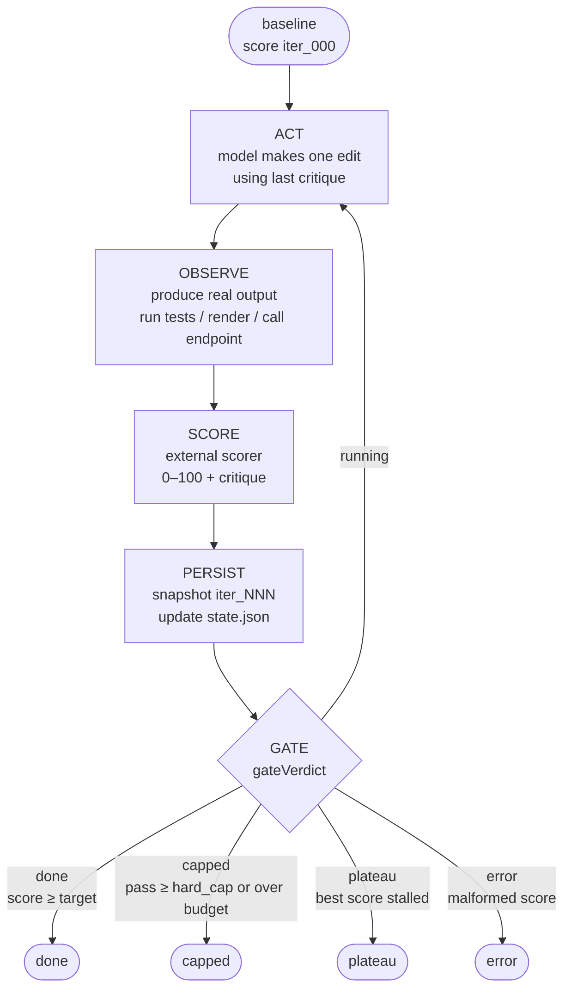

# claude-whetstone

A deterministic **loop-engineering** driver for Claude Code: raise *one* artifact
toward a measured score threshold, where **code owns the gate** and the **model
owns only diagnosis + edits**.

> Status: **early spike, public.** Built to be matured by running it on itself
> (dogfooding); the cost, auth, and security model are exercised end-to-end, not
> speculative. Expect rough edges.

## The one idea

A soft loop (a prompt that says "keep going until it's good") lets the same model
that wants to stop decide whether it's done. Loop engineering's upgrade is to take
that decision *away* from the model:

| Role | Owner |
|---|---|
| Compute the score, compare to target, count passes, decide continue/stop | **code** (`src/gate.mjs`) |
| Diagnose what's wrong and make one edit | **model** (`src/act-claude.mjs`) |
| Produce the real output and score it 0–100 + write a critique | **scorer** (`scorers/`) |

The model literally cannot vote itself done, because the `score >= target` branch
lives in `gate.mjs`, not in a prompt.

## Loop



Stop conditions, all decided in code (`gateVerdict`): `score >= target` → **done**;
`pass >= hard_cap` → **capped**; best score stalls under `min_delta` across
`plateau_window` passes → **plateau**; malformed score or spend over budget →
**error/capped**. Precedence: `error > done > capped > plateau > running`.

**Done-branch confirmation (optional).** `--confirm-scorer "<cmd>"` adds an independent scorer that
re-checks the artifact **only when the gate says done** — cheap normal passes, skepticism paid only
at the finish line. If the confirm score is below target, the `done` is vetoed (the editor gamed the
primary signal) and the loop keeps going, steered by the confirm critique. Point it at a held-out
test set or an independent judge. This is whetstone's anti-reward-hacking layer above `composite`.

## Quickstart

```bash
node src/driver.mjs "make the suite pass" \
  --artifact src/thing.mjs \
  --scorer 'node scorers/test-pass-rate.mjs --cmd "node --test"' \
  --target 100 --cap 8 --budget 2.00
```

Run state lands in `.loop/<run>/` (gitignored): `state.json`, `snapshots/iter_NNN.*`,
`reviews/review_NNN.json`. Each pass writes a full verbatim copy of the artifact, so disk
use scales with `artifact_size × total passes` — and `--resume --cap` raising the limit keeps
extending the same run's directory. Budget the run dir accordingly for large artifacts or long
resumed loops; there's no automatic snapshot pruning.

### Resuming a capped run

A run that hit its cap or budget below target can continue from `state.json` instead of
starting over — history, best score, snapshots, and spend all carry forward:

```bash
node src/driver.mjs --resume --loop-dir .loop/<run> --cap 16   # raise the limit, keep going
```

You **must** relax the binding limit (`--cap`/`--budget`) — otherwise the gate that stopped
the run stops it again immediately, and resume refuses with an actionable message. Resume
restarts the editor ladder from the cheap model (re-escalating only if it plateaus again) and
skips re-scoring a baseline (the live artifact is already the best snapshot). Optionally
override `--target`/`--model` too; anything you don't pass keeps its saved value.

## Model allocation (haiku / sonnet / opus)

Quality in a loop is `model × scorer × iterations`, not raw model strength alone. So
spend the strong model where it buys the most and keep the per-pass editor cheap:

| Role | Default | Use |
|---|---|---|
| **Editor** — every pass | **sonnet** | real code/content edits. Drop to **haiku** for trivial/mechanical artifacts (the canary converged on Haiku for $0.05). |
| **Scorer** — deterministic | **code** | test-pass-rate, compile, type-check, SSIM — a perfect, free signal. No model at all. |
| **Scorer** — subjective | **opus** judge (`scorers/llm-judge.mjs`) | when "good" can't be checked by code. Put the reasoning budget in the *critic*, not the editor. |
| **Escalation** — on plateau only | **opus** | when the cheap editor is *provably stuck* (the gate emits `plateau`) the loop switches to Opus for one fresh window, then gives up if still stuck. `--no-escalate` to disable. |

Why: editing ("apply this specific critique") is the easy half and runs every pass — a
cheap model does it well, and `--cap 10` of Opus edits is wasteful. *Evaluation* defines
the gradient, so put strength there (or in code). You pay Opus-as-editor only when the
loop **proves** you need it (a plateau), never up front.

On escalation the strong editor runs in **rescue mode**: it is told a cheaper model already
plateaued here and to make a *bolder, different-strategy* edit, not a pricier version of the same
local tweak. One decisive jump — never a cheap→mid→opus retry ladder, since a plateau is already
evidence the cheaper config is exhausted (paying for the low-odds rungs is false economy).

Strength rises on **both dials** in that jump: the rescue editor also steps reasoning effort up to
`high`, while forward passes run at `--effort` (default **medium**). Editing is the *easy half*
("apply this critique"), so the editor stays cheap on both dials — reserve `max` effort for a judge
scorer (evaluation is the hard half) or a deep-stall override, never a uniform `max` every pass.

## ⚠️ Cost & auth (read before the first live run)

Directly measured on this machine (2026-06-22), **not** hand-waved:

- A single trivial `claude -p` call (reply "OK", clean cwd, MCP suppressed) cost
  **$0.22 on Opus / ~$0.05 on Haiku**, burning **~44K tokens** of context tax (system
  prompt + slash commands + tool defs) *even with no CLAUDE.md and no MCP loaded*. So
  **use `--model haiku` (or sonnet) for the act step** — Opus at `--cap 10` is ~$2.2+
  per loop in overhead alone. The code-owned `--budget` ceiling halts the run (checked
  after each pass, so it can overshoot by one pass's cost — pair it with `--cap`). On a
  subscription (Max/Pro) plan that USD figure is only a *notional* API-equivalent price — bound
  the run with **`--budget-tokens <N>`** instead (the total tokens the rate limit actually counts);
  it is checked after each pass the same way, so pair either budget with `--cap`.
- `--mcp-config empty-mcp.json --strict-mcp-config` **works** (`mcp_servers` → `[]`) —
  a real cost lever. An empty config is bundled at `empty-mcp.json`.
- `--bare` (which would zero the tax) **does not work for OAuth/subscription (Max/Pro)
  auth** — it returns "Not logged in"; it needs `ANTHROPIC_API_KEY`. Use `--mcp-config`
  + a clean cwd instead.
- The act step runs the nested `claude -p` **in the artifact's own directory** with
  `acceptEdits`, so the unattended edit inherits *that* project's config and permissions.
  The artifact's project must *permit* the edit — a restrictive `settings.json`/CLAUDE.md deny
  layer blocks it and the no-op guard halts a pass that changed nothing. But do **not** point
  the loop at a repo with *broad* write/exec grants either: it will auto-accept edits there
  every pass with no human in the loop. Scope the artifact's project so the edit is allowed and
  the blast radius is just that artifact.
- The scorer's critique is fed back into the editor prompt each pass. It is **untrusted data**
  (a model judge or custom scorer can echo artifact/observed content), so the prompt fences it
  and tells the editor to ignore instructions inside it — a *soft* mitigation. The real control
  is the permission scope above: prompt rules are advisory, the project's allow/deny layer is not.

Validated end-to-end 2026-06-22: `TODO` → `DONE` converged at pass 1 on Haiku for
**$0.05** (gate owned the stop, the model owned the edit, the scorer owned the number).

## Backends & the Claude Code Workflow tool

The gate (`gate.mjs`), the loop (`loop.mjs`), and the scorers are backend-agnostic —
they don't care *how* the edit happens. The shipped, guaranteed backend is the
headless `claude -p` act step (`act-claude.mjs`): it runs from any plain terminal or
cron with just the `claude` CLI. That portability — detached, unattended, own-quota —
is whetstone's reason to exist, so it takes **no dependency on the Claude Code Workflow
tool**, which is entitlement-gated (e.g. Max 20×) and tied to a live session (it can't
run detached/cron).

If you're already *in* an interactive session with the Workflow tool, you don't need
whetstone for that — a short Workflow script with a `while (score < target)` gate does
the same code-owned loop in-session, and cheaper (warm subagents skip the per-spawn
context-reload tax the CLI pays on each act). Pick by quadrant: **Workflow for
attended/interactive, whetstone for detached/unattended/cron.** The `act` step is just
an injectable function returning `{ changed, costUsd }`, so a Workflow-backed `act`
would be a drop-in if anyone ever wants it — a future option, not a dependency.

## When to use (and not)

USE it only when one-shot already failed **and** progress is *measurable* (a real
scorer exists) — raise a test pass-rate, a rubric score, an image/embedding
similarity. Do **not** wrap a one-shottable task in a loop (wrong scale wastes
tokens), don't point it at a whole-repo refactor (it raises *one* artifact), and
don't hand-craft a rigid static harness — the scorer is the pluggable seam exactly
so you don't have to. Most tasks don't need a feedback controller.

## Install as a Claude Code plugin

whetstone ships as a single-plugin Claude Code marketplace (`.claude-plugin/`). Register it by
`owner/repo` and install — the repo *is* the marketplace, so `source: "./"` resolves to its root:

```bash
claude plugin marketplace add develku/claude-whetstone
claude plugin install whetstone@whetstone
```

> Developing whetstone itself? Register your local checkout instead:
> `claude plugin marketplace add "/absolute/path/to/claude-whetstone"` (quote a path with spaces —
> the interactive `/plugin marketplace add` slash form mistakes a quoted path for a GitHub repo and
> the clone fails).

Install **snapshots** the plugin into `~/.claude/plugins/cache/` — it is a copy, not the live
repo, so after editing whetstone's own code run `claude plugin update whetstone@whetstone` (and
restart the session) to pick the changes up. The command surfaces as **`/whetstone:whet`** — a
guided launcher that collects the goal, artifact, scorer, target, and a required cost bound,
shows the assembled command plus a worst-case cost estimate, and runs the driver only after you
confirm; `/whetstone:whet resume` continues a stopped run.

## Layout

```
.claude-plugin/     plugin.json + marketplace.json    (Claude Code plugin manifest)
commands/whet.md    the /whet guided launcher         (slash-only, confirm-before-run)
src/gate.mjs        code-owned gate (pure)            test/gate.test.mjs
src/state.mjs       state.json + snapshots/reviews    (covered via loop/driver)
src/loop.mjs        control flow (deps injected)      test/loop.test.mjs
src/resume.mjs      --resume gate pre-check (pure)     test/resume.test.mjs
src/act-claude.mjs  the headless claude -p edit step  (live-validated, not unit-tested)
src/driver.mjs      CLI + real wiring                 test/driver.test.mjs, test/resume-driver.test.mjs
scorers/test-pass-rate.mjs   reference scorer          test/scorer.test.mjs
scorers/composite.mjs        min-combine N sub-scorers  test/composite.test.mjs
```

**Composing scorers.** `composite.mjs` gates on several dimensions at once — list one
sub-scorer command per line in a manifest and combine by `min`, so the loop can't call it
`done` until *every* dimension clears target (a green test suite won't ship while a paired
security/robustness judge is still low):

```bash
# gate.txt
node scorers/test-pass-rate.mjs --cmd "node --test"
node scorers/llm-judge.mjs --goal "secure & robust" --rubric @sec-rubric.md --model opus
```
```bash
--scorer 'node scorers/composite.mjs --scorers-file gate.txt'
```

`npm test` runs the full suite with no spend — the loop/driver tests inject a stub
`act` and the scorers are deterministic; `act-claude.mjs`'s real `claude -p` spawn is
live-validated, not unit-tested. See `SPEC.md` for the file/scorer/gate contracts.

## Prior art & inspiration

The "external evaluator owns the gate" thesis is from the **Loop Engineering** talk
(코드팩토리). The code-owned hard-cap-with-re-injection pattern is the **Ralph
Wiggum** technique, shipped as the official **ralph-loop** plugin — whetstone reuses
its code-owned cap but replaces its model-emitted "promise" completion gate with a
real score threshold.
