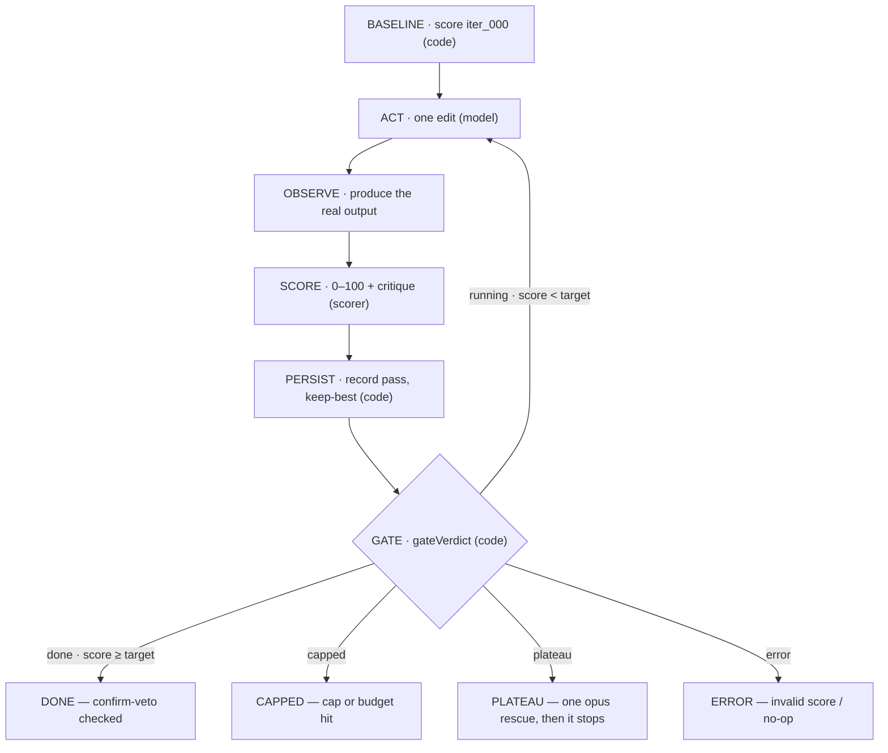

<p align="center">
  
</p>

<h1 align="center">claude-whetstone</h1>

<p align="center">
<b>whetstone keeps editing one file and re-scoring it until a number says it's good enough — or a limit stops it.</b><br>
A deterministic <b>loop-engineering</b> driver for Claude Code: <b>code owns the gate</b>, the <b>model owns only diagnosis + edits</b>.
</p>

> **Status: v1.12.0** — the single-file core is **stable**; the multi-file and orchestration layers are
> **beta — in active dogfooding**: run for real (findings tracked), not yet stable-pinned and with `done`
> still provisional. Matured by running it on itself, so the cost, auth, and security model are exercised
> end-to-end, not speculative. Requires **Node ≥ 23.5** — the behavioural scorers isolate untrusted code
> with `module.registerHooks` + the Permission Model. The full release history lives in
> [CHANGELOG.md](CHANGELOG.md); this README stays a description of *what the tool does and why*.
> Just want to run it? Jump to [Install](#install-as-a-claude-code-plugin). See
> [Architecture & maturity](#architecture--maturity).

This README is in three movements: **Understand** the ideas, **Use** the tool, then the full **Reference**.

---

> **Part 1 — Understand:** what it is, the five core ideas, and how the whole stack fits under one gate.

## What whetstone is

whetstone is easy to mistake for two adjacent things it isn't:

- **Not a soft/goal-seeking loop.** whetstone's stop/continue decision belongs to **code**, not the
  model that wants to stop — the mechanics are in [The one idea](#the-one-idea).
- **Not the Claude Code Workflow tool.** Workflow is deterministic multi-agent orchestration for an
  *attended* session — it has no code-owned quality gate of its own. whetstone owns the gate on
  *one artifact* and can run detached/unattended/cron; a Workflow script can optionally be dropped
  in as its `act` backend, but Workflow is never the gate owner (see
  [Backends & the Workflow tool](#backends--the-claude-code-workflow-tool)).

The feature set built on top of that one gate: pluggable 0–100 scorers, automatic **keep-best**
rollback when an edit makes things worse, a **plateau → escalation ladder** (one stronger editor per
proven stall, e.g. opus then Fable 5) before giving up,
dual **token/USD budgets with crash-resume**, and an optional **confirm-scorer** layer that
re-checks the artifact only at the done branch to catch reward-hacking.

## Core concepts — and why each exists

whetstone is five ideas stacked on one. Each row below is a decision the design makes and the reason
it makes it — read them before the mechanics, and the rest of this README is just detail on these five.

| Concept | What it means | Why it exists |
|---|---|---|
| **Code owns the gate** | the stop/continue decision is a pure function in `src/gate.mjs`, not a prompt; the model only edits and diagnoses, a scorer only produces a number, and code compares it to your target | a soft loop lets the same model that wants to stop decide it is done, so it quits early or declares false victory — moving the decision into code makes "done" a measured fact instead of an opinion |
| **A gate is only as strong as its scorer** | the gate is whatever scorer returns 0–100; different scorers measure different truths — do the tests pass, do the claims hold, is anything important missing | pick the wrong axis and a bad artifact sails through; the composed doc gate exists precisely because one scorer measured claim precision but was blind to omission |
| **Forge — the verifier that learns** | when a `done` is vetoed or reached too easily, the loop learns a new per-file check that separates the good version from the bad and stores it beyond the editor's reach | a fixed target gets gamed over a long unattended run, so the gate has to grow stronger rather than stay a static bar a clever editor eventually walks around |
| **Sandbox the untrusted code** | every behavioural scorer runs candidate code inside a locked-down out-of-process child — no filesystem writes, no network, no subprocess spawning | scoring by *running* the artifact means executing code the model wrote, which must never reach the scorer's own process or the host machine around it |
| **Widen scope under an AND-gate** | the beta control plane raises many objectives at once and only calls the whole thing done when every objective is met, picking winners on a held-out truth | one file is not a whole repo; a repo-wide goal is a set of objectives, and "each part looks done" is emphatically not "the real goal is done" |

## How the loop works



**In plain words.** whetstone keeps editing *one* file and re-scoring it until a number says it's good
enough — or until a limit says stop. Each round a cheap model (haiku/sonnet) makes one small edit; an
external scorer grades the result **0–100** and writes a one-line critique; then **code** (not the model)
checks that score against your target and your budget and decides whether to go again. The model can't
vote itself done — only the score can. If an edit makes things worse the best version is restored; if the
cheap model gets stuck, one bolder Opus pass is tried; when the target, the pass cap, or the token/USD
budget is reached, the loop stops on its own.

Stop conditions, all decided in code (`gateVerdict`): `score >= target` → **done**;
`pass >= hard_cap` → **capped**; best score stalls under `min_delta` across `plateau_window` passes →
**plateau**; malformed score or spend over budget → **error/capped**. Precedence:
`error > done > capped > plateau > running`. That decision, in order, is the whole gate:

<p align="center">
  
</p>

**Done-branch confirmation (optional).** `--confirm-scorer "<cmd>"` adds an independent scorer that
re-checks the artifact **only when the gate says done** — cheap normal passes, skepticism paid only
at the finish line. If the confirm score is below target, the `done` is vetoed (the editor gamed the
primary signal) and the loop keeps going, steered by the confirm critique. Point it at a held-out
test set or an independent judge. This is whetstone's anti-reward-hacking layer above `composite`.

## The one idea

A soft loop (a prompt that says "keep going until it's good") lets the same model that wants to stop
decide whether it's done. Loop engineering's upgrade is to take that decision *away* from the model:

| Role | Owner |
|---|---|
| Compute the score, compare to target, count passes, decide continue/stop | **code** (`src/gate.mjs`) |
| Diagnose what's wrong and make one edit | **model** (`src/act-claude.mjs`) |
| Produce the real output and score it 0–100 + write a critique | **scorer** (`scorers/`) |

The model literally cannot vote itself done, because the `score >= target` branch lives in `gate.mjs`,
not in a prompt. That claim is executable — the doc gate (`doc-exec`) actually runs this block against
the live gate on every scoring pass:

```js
import assert from 'node:assert/strict'
import { gateVerdict } from './src/gate.mjs'

const state = { target_score: 98, hard_cap: 8, min_delta: 0.5, plateau_window: 3, pass: 1, history: [{ score: 50.91 }] }
assert.equal(gateVerdict(state).status, 'running') // below target: code keeps the loop alive

state.pass = 2
state.history.push({ score: 98.2 })
assert.equal(gateVerdict(state).status, 'done') // a measured score cleared the target: code declares done
```

## Architecture & maturity

That one loop is the foundation. Everything above it reuses the *same* code-owned gate, just at a
wider scope — and the gate gets weaker (more subjective) the wider it reaches, which is why the upper
layers are **beta** (dogfooded, not yet stable) and two seats stay human. From the bottom up:

<p align="center">
  
</p>

**v1 declares the single-file inner loop stable.** The whole-repo **Scope** loop, the **Forge**
verifier-learner, and the multi-objective **Control plane** above it are **beta — in active dogfooding**:
reachable through the `/whet` router (`--scope` / `--objectives`), run for real, with findings tracked in
[`docs/quality-loop/findings-register.md`](docs/quality-loop/findings-register.md). They are **not** stable
and their `done` is **provisional** — the loop proves each leaf *measurable*, not that a *set* of leaves is
*sufficient*, and indirect scorer-capture is not yet closed; those open holes are exactly why they are
beta, not stable, and why dogfooding (not a claim of correctness) is how they harden. The per-layer
surface — each layer's gate owner, keep-best unit, and scorers — is in [SPEC.md](SPEC.md).

The gate is **objective for code** (tests/assertions) and **subjective for non-code** (an `llm-judge`
rubric): whetstone runs on any artifact a scorer can measure, but it is only as strong as the scorer.

The beta surfaces are security-hardened as they mature: v1.4.0 closed a model-authored RCE on the
scope `--decompose` sub-gate boundary — a `test-pass-rate` sub-gate now re-uses the run's **code-owned**
scorer command instead of one the editor could author, and shell scorers with no safe adapter are rejected.

### The dynamic control plane (beta)

Above the single-objective loop, a beta layer turns whetstone into a repo-wide, self-adapting loop —
still under a code-owned **measured** gate, with two seats that stay **permanently human**: authoring the
held-out truth, and accepting a structural replan.

| Surface | What it adds | Safety |
|---|---|---|
| **tournament** (`converge --candidates K`) | K independent candidate editors per objective; the winner is picked on the **held-out** signal, never the gameable visible score | defeats the *winner's curse* (max-over-N on a soft gate optimizes into its blind spots); the held-out bar can never be lowered |
| **global held-out truth gate** (`global_held_out` in a converge manifest) | a top-level acceptance check **separate** from the per-objective confirms — `done` requires it too | backstops *decomposition capture* (every objective met yet the real goal unmet); user-authored, run-immutable (hash-pinned), outside every editScope |
| **structural-feedback detector** (`converge-diagnostics`) | classifies a stalled run: `held_out_fail` / `contradiction` / `impossibility` / `plateau` | diagnostic only — never an authority over the gate |
| **replan proposal** (`replan-cli` / `outer-cli`) | on a decomposition-fault stall, a model proposes a **different** decomposition | proposer-only: the proposal is *written for human review*, never auto-applied; the immutable truth is carried verbatim |

The orchestration runtime is reimplemented in-repo as the **default** portable control plane (`--resume`,
budgets, rollback, crash-recovery); the Claude Code Workflow tool is an *optional attended `act` drop-in*,
never the orchestrator or the gate owner (see [Backends & the Workflow tool](#backends--the-claude-code-workflow-tool)).
Caveat on "portable": only the single-file `driver` is VCS-free (any artifact, cron, no repo). `scope`
and `converge` use **git** commits as their keep-best unit, so they require a clean git repo.

## Scaling to a whole repo (beta)

The `whetstone-scope` loop (`src/scope-cli.mjs`, design in
[`docs/orchestrator-design.md`](docs/orchestrator-design.md)) points the *same* code-owned loop at a whole
repo instead of one file: the model edits across a `--scope` directory, an external scorer measures the
whole project (build + tests), and **git** is the keep-best snapshot — each pass is a commit, and a
regressing pass is rolled back with `git reset --hard`.

```bash
node src/scope-cli.mjs "make the suite pass" \
  --scope /path/to/repo \
  --scorer 'node scorers/test-pass-rate.mjs --cmd "npm test"' \
  --confirm-scorer 'node scorers/test-pass-rate.mjs --cmd "npm run test:held-out"' \
  --read-only test/,scripts/ --target 100 --cap 20 --budget-tokens 3000000 \
  --mcp-config empty-mcp.json
```

Two code-owned safety guards — enforced, not prompt-only:

- **The editor can't edit its own gate.** Anything under `--read-only` (your tests / scorer config) is
  hard-reverted after each pass, so a pass can't raise the score by weakening the test.
- **It won't run on a dirty tree.** Because the loop commits and `git reset --hard`s the scope, it refuses
  to start unless the repo is clean — an unattended rollback can't clobber your uncommitted work. Run it
  on a clean checkout or a dedicated branch.

The done-edge `--confirm-scorer` re-runs a **held-out** suite from a *clean checkout* of the committed
pass, so a model that games the visible score still can't reach done. It raises a fixed, measured bar —
it is not (yet) an open-ended planner; that's the v2 tier in the design doc.

**Forge — the verifier that learns (`--forge`, opt-in).** When the held-out confirm *vetoes* a `done`,
that's evidence the visible scorer was gamed. Forge materialises the good (committed) and bad (vetoed)
versions into separate worktrees and learns a new **per-file** check that tells them apart — corroborated
by an independent oracle, regression-tested against the exploit it just caught, and auto-retired if it
later turns flaky. The learned checks are stored *outside* the scope (`--forge-store`) so the editor
can't reach them. It's how the gate gets *stronger* over a long run instead of staying a fixed target —
beta, and (for the veto trigger) it needs `--confirm-scorer`.

Forge also fires on the *opposite* signal — an **easy done** (one edit pass, no done-edge check wired)
learns from the baseline→final pair instead of a gamed snapshot, and the next run consumes the learned
checks. That, the admission rules (oracle corroboration, mutation-admit, exploit-regression), and the
per-run discard-memory (`TRIED-AREAS`, the nonce-fenced list of areas already attacked without gain) are
documented in [SPEC.md](SPEC.md).

## Backends & the Claude Code Workflow tool

The gate (`gate.mjs`), the loop (`loop.mjs`), and the scorers are backend-agnostic — they don't care
*how* the edit happens. The shipped, guaranteed backend is the headless `claude -p` act step
(`act-claude.mjs`): it runs from any plain terminal or cron with just the `claude` CLI. That
portability — detached, unattended, own-quota — is whetstone's reason to exist, so it takes **no
dependency on the Claude Code Workflow tool**, which is entitlement-gated (e.g. Max 20×) and tied to a
live session (it can't run detached/cron).

If you're already *in* an interactive session with the Workflow tool, you don't need whetstone for
that — a short Workflow script with a `while (score < target)` gate does the same code-owned loop
in-session, and cheaper (warm subagents skip the per-spawn context-reload tax the CLI pays on each
act). Pick by quadrant: **Workflow for attended/interactive, whetstone for detached/unattended/cron.**
The `act` step is just an injectable function returning `{ changed, costUsd, tokens }`, so a
Workflow-backed `act` would be a drop-in if anyone ever wants it — a future option, not a dependency.

---

> **Part 2 — Use:** install it, drive it with the launcher, bound the spend, and run it for hours.

## Install as a Claude Code plugin

whetstone ships as a single-plugin Claude Code marketplace (`.claude-plugin/`). Register it by
`owner/repo` and install — the repo *is* the marketplace, so `source: "./"` resolves to its root:

```bash
claude plugin marketplace add develku/claude-whetstone
claude plugin install whetstone@whetstone
```

> Developing whetstone itself? Register your local checkout instead:
> `claude plugin marketplace add "/absolute/path/to/claude-whetstone"` (quote a path with spaces —
> the interactive `/plugin marketplace add` slash form mistakes a quoted path for a GitHub repo and
> the clone fails).

Install **snapshots** the plugin into `~/.claude/plugins/cache/` — it is a copy, not the live repo. So
after editing whetstone's own code, **bump `version` in `.claude-plugin/plugin.json`**, then
`claude plugin marketplace update whetstone` and `claude plugin update whetstone@whetstone` and restart
the session (the update is version-gated — an unchanged version is a no-op).

## How to use it — the guided `/whetstone:whet` launcher

You don't need to memorise the CLI. Inside Claude Code the plugin adds a slash command that builds and
runs the loop *for* you, pausing for your confirmation before anything spends money.

**1 · Start it with your goal:**

```
/whetstone:whet make the parser handle empty input without crashing
```

**2 · Claude asks you five things** — and won't run until each is answered:

| Claude asks | What you give | Example |
|---|---|---|
| **Goal** | what "better" means (fed into every edit) | "handle empty input" |
| **Artifact** | the *one* file the loop may edit | `src/loop.mjs` |
| **Scorer** | how each pass is graded 0–100 | `test-pass-rate` over `node --test` |
| **Target** | the score that counts as done | `100` |
| **Cost bound** | a hard limit so it can't run away | `--cap 8` + `--budget-tokens 1200000` |

> One more, only if your config hasn't settled it: whether a plateau should climb the rescue ladder
> to **Claude Fable 5** (`--model-escalate fable` = opus rescues first; Fable 5 only if opus also
> stalls) — top-tier, priced above opus, opt-in per run. Set `"escalateModel": "fable"` or
> `"offerFableEscalation": false` in `whetstone.config.json` to stop being asked.

**3 · Claude shows the exact command and a worst-case cost** (cap × per-call), then waits. Nothing runs
until you say go — every confirmed pass auto-accepts file edits and spends real money, so this gate is
the whole point.

**4 · It runs, prints the score after each pass, and stops itself** at done / capped / plateau / error.

### Controlling spend — just say how far it can go

You never type a flag. Tell the launcher your limit in plain words and it sets it for you — and it
**won't start without one**, so you can't accidentally kick off an unbounded paid loop:

| You say… | Claude sets |
|---|---|
| "stop after 8 tries" | a **pass cap** — the hard ceiling; always have one |
| "don't spend over $2" | a **dollar budget** |
| "keep it under ~1.2M tokens" | a **token budget** — best on a Max/Pro plan, where the dollar figure is only notional and tokens are what your rate limit counts (≈ `cap × 150000`) |

Claude shows the worst-case total and waits for your OK before spending anything, and the limit is
re-checked after every pass. Set your usual ceiling once in `whetstone.config.json` and it stops asking.

> *Power users:* these are the `--cap` / `--budget` / `--budget-tokens` flags — `--cap` is the true hard
> stop (the budgets are checked *after* a pass, so they can overshoot by one). See **⚠️ Cost, auth &
> budgets** below.

### Resuming a stopped run

Say **`/whetstone:whet resume`** (or run the CLI) to continue a run that stopped under target — history,
best score, snapshots, and spend all carry forward instead of starting over:

```bash
node src/driver.mjs --resume --loop-dir .loop/<run> --cap 16   # raise the limit, keep going
```

You **must** relax the binding limit (`--cap` / `--budget` / `--budget-tokens`), or the gate that stopped
the run stops it again immediately and resume refuses with an actionable message. Resume restarts the
editor ladder from the cheap model (re-escalating only on another plateau) and skips re-scoring a
baseline; override `--target` / `--model` too if you like — anything you don't pass keeps its saved value.

## Command examples

Prefer the guided `/whetstone:whet` launcher above for everyday use — these are the raw commands it
builds, handy for scripting, cron, or power users.

Raise a source file until its test suite passes (deterministic scorer, no model in the loop but the editor):

```bash
node src/driver.mjs "make the suite pass" \
  --artifact src/thing.mjs \
  --scorer 'node scorers/test-pass-rate.mjs --cmd "node --test"' \
  --target 100 --cap 8 --budget 2.00
```

**Composing scorers.** `composite.mjs` gates on several dimensions at once — list one sub-scorer
command per line in a manifest and combine by `min`, so the loop can't call it `done` until *every*
dimension clears target (a green test suite won't ship while a paired security/robustness judge is low):

```bash
# gate.txt
node scorers/test-pass-rate.mjs --cmd "node --test"
node scorers/llm-judge.mjs --goal "secure & robust" --rubric @sec-rubric.md --model opus
```
```bash
--scorer 'node scorers/composite.mjs --scorers-file gate.txt'
```

Run state lands in `.loop/<run>/` (gitignored): `state.json`, `snapshots/iter_NNN.*`,
`reviews/review_NNN.json`. Each pass writes a full verbatim copy of the artifact, so disk use scales
with `artifact_size × total passes`; there's no automatic snapshot pruning. `npm test` runs the full
suite with no spend — the loop/driver tests inject a stub `act` and the scorers are deterministic.

## Long, unattended runs

Want it to grind for hours on its own? Just ask the launcher in plain words — for example:

> **`/whetstone:whet`** raise `src/loop.mjs` to a 95% test score, run it unattended for up to 60
> passes on a ~8M-token budget.

Claude picks a deterministic scorer (so every pass gets a real signal), sets the cap and token budget,
and can launch it **detached** so it keeps going after you close the terminal — this is whetstone's
reason to exist: no live session and no Workflow-tool entitlement, so it can even run from `cron`. Then
it manages the long haul itself:

- **plateau →** one bold Opus rescue, then it gives up rather than burning Opus every pass;
- **keep-best →** a regressing edit is rolled back, so the run can't drift backward;
- **transient blips →** a rate-limit/API-overload editor failure is retried with backoff (parity with
  the judge's v1.5.1 retry), so one API blip can't kill an overnight run;
- **confirmation →** an independent finish-line check (`--confirm-scorer`) vetoes a gamed "done" — which
  matters more the longer it runs.

Check in any time without attaching — `tail` the log, or read `best_score` / `pass` / `spent_tokens` in
`state.json` — and if it stops under target, just ask Claude to resume with a higher limit.

<details>
<summary><b>Power users / cron — the raw commands</b></summary>

```bash
# launch detached, survives the terminal closing
nohup node src/driver.mjs "<goal>" --artifact src/thing.mjs \
  --scorer 'node scorers/composite.mjs --scorers-file gate.txt' \
  --target 95 --cap 60 --budget-tokens 8000000 \
  --loop-dir .loop/longrun-01 --mcp-config empty-mcp.json > .loop/longrun-01/run.log 2>&1 &

# capped below target? resume with a raised limit
node src/driver.mjs --resume --loop-dir .loop/longrun-01 --cap 120 --budget-tokens 16000000
```
</details>

> Caveats: every pass writes a full artifact snapshot with no pruning, so disk ≈ `artifact_size ×
> passes`; the editor auto-accepts edits unattended for hours, so scope the artifact's project
> permissions tightly; and a run still raises **one** artifact — not a whole-repo refactor.

## ⚠️ Cost, auth & budgets (read before the first live run)

Measured on this machine (2026-06-22): a single `claude -p` call costs **$0.22 on Opus / ~$0.05 on
Haiku** — about 44K tokens of context tax per call even with no CLAUDE.md or MCP — so **run the act step
on `--model haiku` (or sonnet)**, not Opus. Two cost dials cap the run, each checked after a pass (so
pair with `--cap`): `--budget <USD>` and `--budget-tokens <N>`; each pass burns ~100–150K tokens, so a
token budget is roughly `cap × 150000`, and on a Max/Pro plan `--budget-tokens` is the meaningful bound.
A real lever is `--mcp-config empty-mcp.json --strict-mcp-config`, which suppresses the MCP tool tax
(`--bare` does *not* work under subscription auth).

The act step runs the nested `claude -p` **in the artifact's own directory** with `acceptEdits` and no
human in the loop, so **scope that project's permissions tightly** — the blast radius should be just the
artifact (the driver warns before a cross-repo run whose target grants a broad permission surface). The
scorer critique fed back each pass is untrusted data (prompt-fenced — a *soft* mitigation; the real
control is the permission scope). Persist your usual `budgetTokens` / `hardCap` / `model` in
`whetstone.config.json`; [SPEC.md](SPEC.md) lists every config key.

## Model allocation (haiku / sonnet / opus)

Quality in a loop is `model × scorer × iterations`, not raw model strength alone. So spend the strong
model where it buys the most and keep the per-pass editor cheap:

| Role | Default | Use |
|---|---|---|
| **Editor** — every pass | **sonnet** | real code/content edits. Drop to **haiku** for trivial/mechanical artifacts (the canary converged on Haiku for $0.05). A transient fatal exit (rate limit, API overload) is retried with backoff (3 attempts, loud on stderr) — parity with the judge — so one blip can't kill an unattended run; failed attempts stay uncounted (`--cap` is the backstop). |
| **Scorer** — deterministic | **code** | test-pass-rate, compile, type-check, SSIM — a perfect, free signal. No model at all. |
| **Scorer** — subjective | **opus** judge (`scorers/llm-judge.mjs`) | when "good" can't be checked by code. Put the reasoning budget in the *critic*, not the editor. Retries a transient `claude` failure (3 attempts, short backoff, loud on stderr) before reporting scorer failure, so one API blip can't kill a paid run. Reports its own per-call `usage` on the review, so `spent_tokens`/`spent_usd` charge the judge's spend too (previously invisible — measured at ~20% of a real run's tokens / ~30% of its USD). Done-edge stability/confirm probes and failed retry attempts remain uncounted; `--cap` stays the hard backstop. |
| **Escalation** — on plateau only | **opus** (ladder to fable) | when the cheap editor is *provably stuck* (the gate emits `plateau`) the loop climbs the escalation ladder one rung per stall — `--model-escalate fable` means opus rescues first, Fable 5 only if opus also stalls — and gives up when the ladder is exhausted. `--no-escalate` to disable. |

Why: editing ("apply this specific critique") is the easy half and runs every pass — a cheap model
does it well, and `--cap 10` of Opus edits is wasteful. *Evaluation* defines the gradient, so put
strength there (or in code). You pay Opus-as-editor only when the loop **proves** you need it (a
plateau), never up front.

On a plateau the strong editor runs in **rescue mode** — told a cheaper model already stalled here, it
makes a *bolder, different-strategy* edit, one decisive jump per proven stall (never a blind cheap→top
schedule), stepping reasoning effort up as it climbs. The ladder order (`fable` expands to `opus,fable`),
its effort-floor mechanics, and the code-owned **thin-scorer-suspicion** warning on a suspiciously easy
`done` are documented in [SPEC.md](SPEC.md).

## When to use (and not)

USE it only when one-shot already failed **and** progress is *measurable* (a real scorer exists) —
raise a test pass-rate, a rubric score, an image/embedding similarity. Do **not** wrap a one-shottable
task in a loop (wrong scale wastes tokens), don't point it at a whole-repo refactor (it raises *one*
artifact), and don't hand-craft a rigid static harness — the scorer is the pluggable seam exactly so
you don't have to. Most tasks don't need a feedback controller.

---

> **Part 3 — Reference:** the file map here; the complete flag / scorer / config / module reference in SPEC.md.

## Full reference → SPEC.md

Every flag, scorer, config key, and hardening module — alongside the gate / scorer / act contracts —
lives in **[SPEC.md](SPEC.md)**, which the `doc-coverage` gate keeps complete (it can never silently
omit a flag). The everyday flags appear in the usage guide above; reach for SPEC.md when you need the
full CLI surface, and [CHANGELOG.md](CHANGELOG.md) for the version-by-version history.

## Layout

```
.claude-plugin/     plugin.json + marketplace.json    (Claude Code plugin manifest)
commands/whet.md    the /whet guided launcher         (slash-only, confirm-before-run)
src/gate.mjs        code-owned gate (pure)            test/gate.test.mjs
src/state.mjs       state.json + snapshots/reviews    (covered via loop/driver)
src/loop.mjs        control flow (deps injected)      test/loop.test.mjs
src/resume.mjs      --resume gate pre-check (pure)     test/resume.test.mjs
src/act-claude.mjs  the headless claude -p edit step  (live-validated, not unit-tested)
src/driver.mjs      CLI + real wiring + config        test/driver.test.mjs, test/resume-driver.test.mjs
scorers/test-pass-rate.mjs   reference scorer          test/scorer.test.mjs
scorers/composite.mjs        min-combine N sub-scorers  test/composite.test.mjs
scorers/llm-judge.mjs        opus-as-judge (subjective) test/judge.test.mjs
scorers/doc-lint.mjs         doc-vs-repo claim gate     test/doc-lint.test.mjs
scorers/io-*.mjs             behavioural scorers (run candidate code) test/io-*.test.mjs
scorers/doc-*.mjs            doc-lint / doc-coverage / doc-exec        test/doc-*.test.mjs
src/iso-runner.mjs           locked-down out-of-process runner for io-*/doc-exec (untrusted code)
src/prompt-fence.mjs         shared nonce-fence for untrusted, editor-influenced text
src/blast-radius.mjs         reverts sibling-file edits each pass (--allow-sibling-edits opts out)
src/gate-audit.mjs / src/forge/gate-probe.mjs   opt-in done-edge hardening (--gate-audit / --gate-self-probe)
src/scope-*.mjs / src/forge/   beta whole-repo loop + per-file verifier learning (--forge)
src/converge*.mjs / src/plan*.mjs / src/replan*.mjs / src/outer*.mjs / src/whet.mjs   beta control plane + intake router
```

Maturity is covered in [Architecture & maturity](#architecture--maturity) above; the contracts + the
full flag/scorer/config/module reference are in [SPEC.md](SPEC.md).

## Prior art & inspiration

The "external evaluator owns the gate" thesis is from the **Loop Engineering** talk (코드팩토리). The
code-owned hard-cap-with-re-injection pattern is the **Ralph Wiggum** technique, shipped as the
official **ralph-loop** plugin — whetstone reuses its code-owned cap but replaces its model-emitted
"promise" completion gate with a real score threshold.
