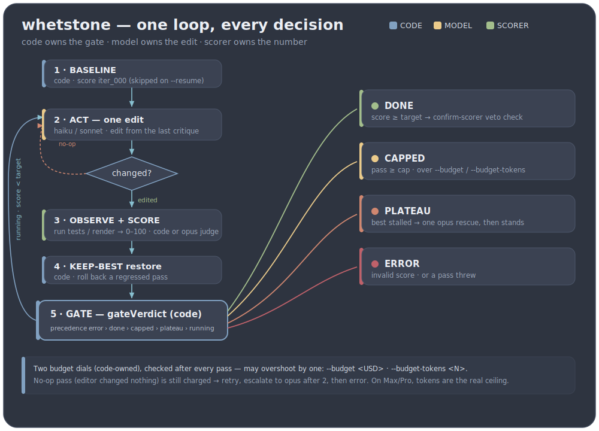

<p align="center">
  
</p>

<h1 align="center">claude-whetstone</h1>

<p align="center">
A deterministic <b>loop-engineering</b> driver for Claude Code — raise <i>one</i> artifact toward a
measured score threshold, where <b>code owns the gate</b> and the <b>model owns only diagnosis + edits</b>.
</p>

> Status: **early spike, public.** Built to be matured by running it on itself (dogfooding); the cost,
> auth, and security model are exercised end-to-end, not speculative. Expect rough edges.

## How the loop works

<p align="center">
  
</p>

**In plain words.** whetstone keeps editing *one* file and re-scoring it until a number says it's good
enough — or until a limit says stop. Each round a cheap model (haiku/sonnet) makes one small edit; an
external scorer grades the result **0–100** and writes a one-line critique; then **code** (not the model)
checks that score against your target and your budget and decides whether to go again. The model can't
vote itself done — only the score can. If an edit makes things worse the best version is restored; if the
cheap model gets stuck, one bolder Opus pass is tried; when the target, the pass cap, or the token/USD
budget is reached, the loop stops on its own.

Stop conditions, all decided in code (`gateVerdict`): `score >= target` → **done**;
`pass >= hard_cap` → **capped**; best score stalls under `min_delta` across `plateau_window` passes →
**plateau**; malformed score or spend over budget → **error/capped**. Precedence:
`error > done > capped > plateau > running`.

**Done-branch confirmation (optional).** `--confirm-scorer "<cmd>"` adds an independent scorer that
re-checks the artifact **only when the gate says done** — cheap normal passes, skepticism paid only
at the finish line. If the confirm score is below target, the `done` is vetoed (the editor gamed the
primary signal) and the loop keeps going, steered by the confirm critique. Point it at a held-out
test set or an independent judge. This is whetstone's anti-reward-hacking layer above `composite`.

## The one idea

A soft loop (a prompt that says "keep going until it's good") lets the same model that wants to stop
decide whether it's done. Loop engineering's upgrade is to take that decision *away* from the model:

| Role | Owner |
|---|---|
| Compute the score, compare to target, count passes, decide continue/stop | **code** (`src/gate.mjs`) |
| Diagnose what's wrong and make one edit | **model** (`src/act-claude.mjs`) |
| Produce the real output and score it 0–100 + write a critique | **scorer** (`scorers/`) |

The model literally cannot vote itself done, because the `score >= target` branch lives in `gate.mjs`,
not in a prompt.

## Install as a Claude Code plugin

whetstone ships as a single-plugin Claude Code marketplace (`.claude-plugin/`). Register it by
`owner/repo` and install — the repo *is* the marketplace, so `source: "./"` resolves to its root:

```bash
claude plugin marketplace add develku/claude-whetstone
claude plugin install whetstone@whetstone
```

> Developing whetstone itself? Register your local checkout instead:
> `claude plugin marketplace add "/absolute/path/to/claude-whetstone"` (quote a path with spaces —
> the interactive `/plugin marketplace add` slash form mistakes a quoted path for a GitHub repo and
> the clone fails).

Install **snapshots** the plugin into `~/.claude/plugins/cache/` — it is a copy, not the live repo. So
after editing whetstone's own code, **bump `version` in `.claude-plugin/plugin.json`**, then
`claude plugin marketplace update whetstone` and `claude plugin update whetstone@whetstone` and restart
the session (the update is version-gated — an unchanged version is a no-op).

## How to use it — the guided `/whetstone:whet` launcher

You don't need to memorise the CLI. Inside Claude Code the plugin adds a slash command that builds and
runs the loop *for* you, pausing for your confirmation before anything spends money.

**1 · Start it with your goal:**

```
/whetstone:whet make the parser handle empty input without crashing
```

**2 · Claude asks you five things** — and won't run until each is answered:

| Claude asks | What you give | Example |
|---|---|---|
| **Goal** | what "better" means (fed into every edit) | "handle empty input" |
| **Artifact** | the *one* file the loop may edit | `src/parser.mjs` |
| **Scorer** | how each pass is graded 0–100 | `test-pass-rate` over `node --test` |
| **Target** | the score that counts as done | `100` |
| **Cost bound** | a hard limit so it can't run away | `--cap 8` + `--budget-tokens 1200000` |

**3 · Claude shows the exact command and a worst-case cost** (cap × per-call), then waits. Nothing runs
until you say go — every confirmed pass auto-accepts file edits and spends real money, so this gate is
the whole point.

**4 · It runs, prints the score after each pass, and stops itself** at done / capped / plateau / error.

### Controlling spend — Claude enforces it for you

The launcher **refuses to start without at least one ceiling**, so you can't accidentally kick off an
unbounded paid loop:

- **`--cap N`** — the hard stop: at most N passes. Always set this; it is the real ceiling.
- **`--budget <USD>`** — stop once spend crosses a dollar figure.
- **`--budget-tokens <N>`** — stop once total tokens cross N. **On a Max/Pro plan, prefer this** — there
  the dollar number is only a *notional* API-equivalent price, while tokens are what your rate limit
  actually counts. A rough budget is `cap × 150000` (so `--cap 8` ≈ `--budget-tokens 1200000`).

The two `--budget*` dials are checked *after* each pass (so they can overshoot by one pass) — that is why
you pair them with `--cap`. Claude prints the worst-case total before you confirm, and you can set your
usual limits once in `whetstone.config.json` so you never retype them (see **⚠️ Cost, auth & budgets**
below).

### Resuming a stopped run

Say **`/whetstone:whet resume`** (or run the CLI) to continue a run that stopped under target — history,
best score, snapshots, and spend all carry forward instead of starting over:

```bash
node src/driver.mjs --resume --loop-dir .loop/<run> --cap 16   # raise the limit, keep going
```

You **must** relax the binding limit (`--cap` / `--budget` / `--budget-tokens`), or the gate that stopped
the run stops it again immediately and resume refuses with an actionable message. Resume restarts the
editor ladder from the cheap model (re-escalating only on another plateau) and skips re-scoring a
baseline; override `--target` / `--model` too if you like — anything you don't pass keeps its saved value.

## Command examples

Prefer the guided `/whetstone:whet` launcher above for everyday use — these are the raw commands it
builds, handy for scripting, cron, or power users.

Raise a source file until its test suite passes (deterministic scorer, no model in the loop but the editor):

```bash
node src/driver.mjs "make the suite pass" \
  --artifact src/thing.mjs \
  --scorer 'node scorers/test-pass-rate.mjs --cmd "node --test"' \
  --target 100 --cap 8 --budget 2.00
```

**Composing scorers.** `composite.mjs` gates on several dimensions at once — list one sub-scorer
command per line in a manifest and combine by `min`, so the loop can't call it `done` until *every*
dimension clears target (a green test suite won't ship while a paired security/robustness judge is low):

```bash
# gate.txt
node scorers/test-pass-rate.mjs --cmd "node --test"
node scorers/llm-judge.mjs --goal "secure & robust" --rubric @sec-rubric.md --model opus
```
```bash
--scorer 'node scorers/composite.mjs --scorers-file gate.txt'
```

Run state lands in `.loop/<run>/` (gitignored): `state.json`, `snapshots/iter_NNN.*`,
`reviews/review_NNN.json`. Each pass writes a full verbatim copy of the artifact, so disk use scales
with `artifact_size × total passes`; there's no automatic snapshot pruning. `npm test` runs the full
suite with no spend — the loop/driver tests inject a stub `act` and the scorers are deterministic.

## Long, unattended runs

whetstone is built for the detached, hours-long case — a real scorer gives every pass a gradient, and
code (not you) holds the wheel:

1. **Pick a deterministic scorer** so each pass gets a real signal — `test-pass-rate`, or `composite`
   (tests + a judge). A long run only pays off when the gradient is real.
2. **Set a high cap and a token budget as the true ceiling.** On a Max/Pro plan, tokens — not USD — are
   what the rate limit counts; a token budget is roughly `cap × 150000`:
   ```bash
   node src/driver.mjs "<goal>" --artifact src/thing.mjs \
     --scorer 'node scorers/composite.mjs --scorers-file gate.txt' \
     --target 95 --cap 60 --budget-tokens 8000000 \
     --model sonnet --loop-dir .loop/longrun-01 --mcp-config empty-mcp.json
   ```
3. **Detach it** so it survives the terminal closing — this is whetstone's reason to exist (no live
   session, no Workflow-tool entitlement needed):
   ```bash
   nohup node src/driver.mjs "<goal>" --artifact src/thing.mjs --scorer '<scorer>' \
     --cap 60 --budget-tokens 8000000 --loop-dir .loop/longrun-01 \
     --mcp-config empty-mcp.json > .loop/longrun-01/run.log 2>&1 &
   ```
   (or a cron / launchd job for scheduled runs.)
4. **It manages the long haul itself:** on a plateau it tries one bold Opus rescue, then gives up rather
   than burning Opus every pass; keep-best rolls back a regressing edit so the run can't drift backward;
   and `--confirm-scorer` re-checks `done` against an independent signal, vetoing a gamed finish — which
   matters more the longer the run goes.
5. **Watch without attaching:** `tail -f .loop/longrun-01/run.log`, or read `best_score` / `pass` /
   `spent_tokens` in `state.json`.
6. **Capped below target and want more?** Resume with a raised limit:
   ```bash
   node src/driver.mjs --resume --loop-dir .loop/longrun-01 --cap 120 --budget-tokens 16000000
   ```

> Long-run caveats: every pass writes a full artifact snapshot with no pruning, so disk ≈ `artifact_size ×
> passes`; the editor auto-accepts edits unattended for hours, so scope the artifact's project permissions
> tightly; and a run still raises **one** artifact — not a whole-repo refactor.

## ⚠️ Cost, auth & budgets (read before the first live run)

Directly measured on this machine (2026-06-22), **not** hand-waved:

- A single trivial `claude -p` call (reply "OK", clean cwd, MCP suppressed) cost **$0.22 on Opus /
  ~$0.05 on Haiku**, burning **~44K tokens** of context tax (system prompt + slash commands + tool
  defs) *even with no CLAUDE.md and no MCP loaded*. So **use `--model haiku` (or sonnet) for the act
  step** — Opus at `--cap 10` is ~$2.2+ per loop in overhead alone.
- **Two cost dials, either one caps the run** (checked after each pass, so each can overshoot by one
  pass — pair with `--cap`): `--budget <USD>` and `--budget-tokens <N>`. Each pass burns
  **~100–150K tokens**, so a token budget is roughly `cap × 150000`. On a subscription (Max/Pro) plan
  the USD figure is only a *notional* API-equivalent price — `--budget-tokens` is what the rate limit
  actually counts, so prefer it there.
- **Persistent defaults** — set `budgetTokens`, `budgetUsd`, `hardCap`, `model`, `effort` once in
  `~/.config/whetstone/config.json` (personal) or `./whetstone.config.json` (project, wins); CLI flags
  override. See `examples/whetstone.config.json`.
- `--mcp-config empty-mcp.json --strict-mcp-config` **works** (`mcp_servers` → `[]`) — a real cost
  lever. An empty config is bundled at `empty-mcp.json`. `--bare` (which would zero the tax) **does not
  work for OAuth/subscription (Max/Pro) auth** — it returns "Not logged in"; it needs
  `ANTHROPIC_API_KEY`. Use `--mcp-config` + a clean cwd instead.
- The act step runs the nested `claude -p` **in the artifact's own directory** with `acceptEdits`, so
  the unattended edit inherits *that* project's config and permissions. The project must *permit* the
  edit, but do **not** point the loop at a repo with *broad* write/exec grants either — it will
  auto-accept edits there every pass with no human in the loop. Scope the artifact's project so the
  blast radius is just that artifact.
- The scorer's critique is fed back into the editor prompt each pass. It is **untrusted data** (a model
  judge or custom scorer can echo artifact/observed content), so the prompt fences it and tells the
  editor to ignore instructions inside it — a *soft* mitigation. The real control is the permission
  scope above: prompt rules are advisory, the project's allow/deny layer is not.

Validated end-to-end 2026-06-22: `TODO` → `DONE` converged at pass 1 on Haiku for **$0.05** (gate
owned the stop, the model owned the edit, the scorer owned the number).

## Model allocation (haiku / sonnet / opus)

Quality in a loop is `model × scorer × iterations`, not raw model strength alone. So spend the strong
model where it buys the most and keep the per-pass editor cheap:

| Role | Default | Use |
|---|---|---|
| **Editor** — every pass | **sonnet** | real code/content edits. Drop to **haiku** for trivial/mechanical artifacts (the canary converged on Haiku for $0.05). |
| **Scorer** — deterministic | **code** | test-pass-rate, compile, type-check, SSIM — a perfect, free signal. No model at all. |
| **Scorer** — subjective | **opus** judge (`scorers/llm-judge.mjs`) | when "good" can't be checked by code. Put the reasoning budget in the *critic*, not the editor. |
| **Escalation** — on plateau only | **opus** | when the cheap editor is *provably stuck* (the gate emits `plateau`) the loop switches to Opus for one fresh window, then gives up if still stuck. `--no-escalate` to disable. |

Why: editing ("apply this specific critique") is the easy half and runs every pass — a cheap model
does it well, and `--cap 10` of Opus edits is wasteful. *Evaluation* defines the gradient, so put
strength there (or in code). You pay Opus-as-editor only when the loop **proves** you need it (a
plateau), never up front.

On escalation the strong editor runs in **rescue mode**: it is told a cheaper model already plateaued
here and to make a *bolder, different-strategy* edit, not a pricier version of the same local tweak.
One decisive jump — never a cheap→mid→opus retry ladder, since a plateau is already evidence the
cheaper config is exhausted. Strength rises on **both dials** in that jump: the rescue editor also
steps reasoning effort up to `high`, while forward passes run at `--effort` (default **medium**).
Reserve `max` effort for a judge scorer (evaluation is the hard half) or a deep-stall override, never a
uniform `max` every pass.

## Backends & the Claude Code Workflow tool

The gate (`gate.mjs`), the loop (`loop.mjs`), and the scorers are backend-agnostic — they don't care
*how* the edit happens. The shipped, guaranteed backend is the headless `claude -p` act step
(`act-claude.mjs`): it runs from any plain terminal or cron with just the `claude` CLI. That
portability — detached, unattended, own-quota — is whetstone's reason to exist, so it takes **no
dependency on the Claude Code Workflow tool**, which is entitlement-gated (e.g. Max 20×) and tied to a
live session (it can't run detached/cron).

If you're already *in* an interactive session with the Workflow tool, you don't need whetstone for
that — a short Workflow script with a `while (score < target)` gate does the same code-owned loop
in-session, and cheaper (warm subagents skip the per-spawn context-reload tax the CLI pays on each
act). Pick by quadrant: **Workflow for attended/interactive, whetstone for detached/unattended/cron.**
The `act` step is just an injectable function returning `{ changed, costUsd, tokens }`, so a
Workflow-backed `act` would be a drop-in if anyone ever wants it — a future option, not a dependency.

## When to use (and not)

USE it only when one-shot already failed **and** progress is *measurable* (a real scorer exists) —
raise a test pass-rate, a rubric score, an image/embedding similarity. Do **not** wrap a one-shottable
task in a loop (wrong scale wastes tokens), don't point it at a whole-repo refactor (it raises *one*
artifact), and don't hand-craft a rigid static harness — the scorer is the pluggable seam exactly so
you don't have to. Most tasks don't need a feedback controller.

## Layout

```
.claude-plugin/     plugin.json + marketplace.json    (Claude Code plugin manifest)
commands/whet.md    the /whet guided launcher         (slash-only, confirm-before-run)
src/gate.mjs        code-owned gate (pure)            test/gate.test.mjs
src/state.mjs       state.json + snapshots/reviews    (covered via loop/driver)
src/loop.mjs        control flow (deps injected)      test/loop.test.mjs
src/resume.mjs      --resume gate pre-check (pure)     test/resume.test.mjs
src/act-claude.mjs  the headless claude -p edit step  (live-validated, not unit-tested)
src/driver.mjs      CLI + real wiring + config        test/driver.test.mjs, test/resume-driver.test.mjs
scorers/test-pass-rate.mjs   reference scorer          test/scorer.test.mjs
scorers/composite.mjs        min-combine N sub-scorers  test/composite.test.mjs
scorers/llm-judge.mjs        opus-as-judge (subjective) test/judge.test.mjs
```

See `SPEC.md` for the file/scorer/gate contracts and the config format.

## Prior art & inspiration

The "external evaluator owns the gate" thesis is from the **Loop Engineering** talk (코드팩토리). The
code-owned hard-cap-with-re-injection pattern is the **Ralph Wiggum** technique, shipped as the
official **ralph-loop** plugin — whetstone reuses its code-owned cap but replaces its model-emitted
"promise" completion gate with a real score threshold.
